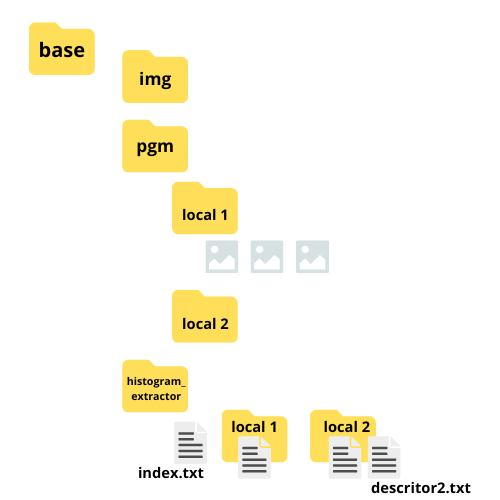
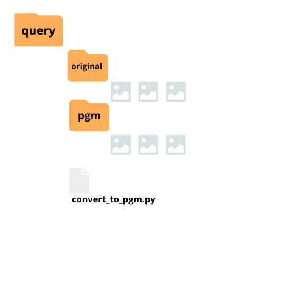
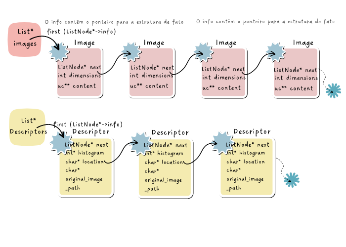

# [Trabalho 2] My Pinterest | Beatriz Auer e Mateus Maioli

**Alunos**: Beatriz Auer Mariano e Mateus Maioli Giacomin<br>
**Disciplina**: Estrutura de Dados<br>
**Professor**: Thiago Meireles Paixão<br>
**Semestre**: 2023/1 - 3º período

## Introdução

O objetivo do trabalho é desenvolver um projeto em C que faça a recuperação de imagens correlacionadas a uma imagem de entrada, baseada em seu conteúdo (*Content-based Image Retrieval*, CBIR). Para isso, utilizou-se a técnica histogramas para realizar a extração de descritores de cada imagem. A extração de conteúdo baseado em histograma consiste na representação da frequência que um determinado valor ocorre: nesse caso, a frequência que um valor de cor de pixel é repetido na matriz de pixels de uma imagem.<br>
Nesse trabalho, utilizou-se imagens no formato PGM em escala de cinza (valores de pixel de 0 a 255).

**Conteúdos relacionados:** implementação de TADs e listas encadeadas.

## Funcionamento do programa

O programa carregará o menu uma vez, e após um comando finalizar sua execução, será possível digitar um novo. Existem dois comandos principais: `index` e `query`. 

### Comandos

`index`

Carrega todas as imagens do banco de dados e seus respectivos descritores em listas encadeadas (images e descriptors, respectivamente). Também gera os arquivos que contêm os descritores de cada imagem, sob `base/histogram_extractor`.

> **Warning**: Para novas imagens na base de dados, consultar a documentação da base de dados abaixo.

Pensamos em excluir esse comando, uma vez que uma query só será executada quando houverem imagens indexadas, mas decidimos deixar por duas razões:

- Mesmo que o comando index fosse rodado, por baixo dos panos, toda vez que query fosse executado, isso consumiria desempenho computacional desnecessário para verificar que imagens que já foram indexadas antes foram indexadas
- Se as imagens foram indexadas apenas uma vez, o usuário não poderá indexar novas imagens em tempo de execução do programa

`query [location] [image_file_name]`

Realiza a consulta das imagens e localidades mais parecidas, de acordo com seus descritores, da imagem passada como parâmetro.

`location` localização a qual a imagem de query se refere.<br>
`image_file_name` nome do arquivo, com extensão, da imagem de consulta.<br>

Um exemplo de uso correto do comando seria:

```diff
query biblioteca query_biblioteca.pgm
```

> **Warning**: Assim como para o comando index, as imagens de consulta devem, obrigatoriamente, estar sob o diretório `query/pgm/`. Veja mais sobre a documentação da base de dados.

O resultado das imagens mais próximas será carregada dentro dos arquivos padrão do diretório `results`. Já as localidades serão exibidas no terminal.

`quit`

Encerra o programa.

## Base de dados

Foram selecionados 10 ambientes do Ifes Campus Serra para representar a nossa base de dados. Cada localidade possui 10 fotos.

> **Warning**: para cada nova localidade que não são as de origem do trabalho que for adicionada, é preciso criar as pastas correspondentes e adicionar as imagens PGM sob as pastas `base/pgm/{new_locality}/` e `base/histogram_extractor/{new_locality}/`, pois o programa não faz isso sozinho. Se você preferir, você poderá adicionar suas imagens em uma nova pasta sob `base/img`, atualizar a `linha 4` do arquivo `base/convert_to_pgm.py` e rodar o arquivo para converter as novas imagens.

As imagens estão armazenadas dentro de `base/pgm/` e divididas por localidade. O diretório base possui, ainda, uma subpasta `histogram_extractor`. A pasta histogram_extractor possui um arquivo `index` que correlaciona o caminho de cada imagem de cada localidade ao seu respectivo descritor e várias outras subspastas, uma para cada localidade, que possuem os arquivos com os descritores das imagens, em si. Dentro de base há um arquivo `convert_to_pgm.py`, que foi adaptado do código dado pelo professor para converter as imagens de `base/img/` em pgm.

As imagens de pesquisa **devem** ser armazenadas sob a pasta `query`. Na pasta `query/original` existem nossas imagens originais em maior qualidade, mas todas as imagens a serem utilizadas para pesquisa devem estar na pasta `query/pgm` no formato pgm, dentro de query há também um arquivo `convert_to_pgm.py`, que foi modificado, e é diferente daquele localizado em base.

> **Note**: a estrutura de pastas foi adaptada da documentação para melhor atender à nossa implementação (e também para ser melhor da gente entender).




## Estruturas

Todas as estruturas abaixo foram implementadas utilizando o conceito de TADs.

> TAD: Tipo Abstrato de Dados.<br>
Consiste na abstração de uma estrutura de dados que define um conjunto de operações permitidas em seus objetos, ocultando os detalhes de implementação e fornecendo uma interface clara para manipular e acessar os dados.<br>
As estruturas foram implementadas, portanto, utilizando um cabeçalho **.h** e implementação **.c**.

Ao iniciar o programa, quand o usuário inserir o comando index, todas as imagens no formato PGM são carregadas em uma lista encadeada do tipo Images, e os seus descritores correspondentes são carregados em outra lista encadeada do tipo Descriptors.

(A imagem abaixo é de uma lista encadeada simples, mas não altera o funcionamento do sistema)


### List

Lista duplamente encadeada genérica. Nesse tipo de estrutura de dados, cada elemento de uma lista, chamado de **nó** possui um ponteiro de referência para o próximo nó da lista e para o anterior. Nesse caso, como a lista é genérica, o nó pode ser um ponteiro para qualquer tipo, como Image, Descriptor, char, int, etc.

Implementação: `list.h list.c`

### Image

Image: estrutura que armazena o conteudo das imagens PGM, como altura, largura, nível máximo de cinza e a matriz dos pixels da imagem. A matriz de pixels da imagem consiste em um vetor de vetores do tipo *unsigned char*.

Implementação: `image.h image.c`

### Descriptor

Descriptor: estrutura que armazena o histograma de escala de cinza de uma dada imagem pgm, além da localização e nome da imagem que o gerou.

Implementação: `descriptor.h descriptor.c`

### Utils

Arquivo que contêm funções genéricas que podem ser utilizadas por todas as estruturas, focada em manipulação de arquivos.

Implementação: `utils.h utils.c`

## Fluxo sugerido
1. Inicializa as localidades do banco de dados, que são listadas no arquivo localities.txt. Execute o comando index para indexar a imagens do banco de dados.
2. Execute suas queries 😀.
3. Ao inserir novas imagens, execute o comando index novamente.
4. Excute o comando quit para encerrar a execução do programa.


